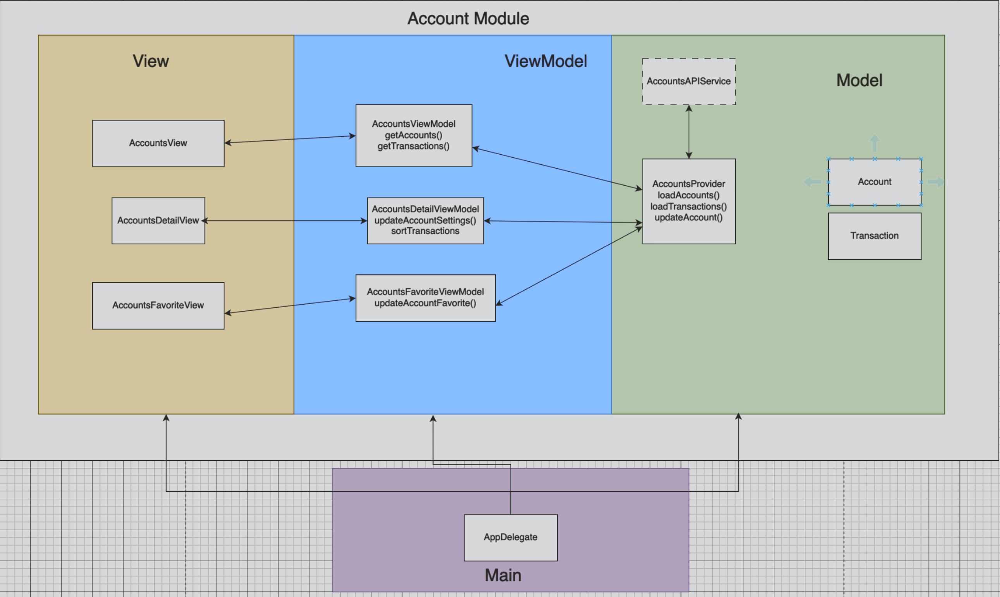

# SampleAccountBank – iOS  

SampleAccountBank is a challenge project to showcase some basic views in SwiftUI and how dependencies and views change.

- [x] **(30 min)** Create a View to show users their bank accounts, and the 3 most recent transactions in each account

- [x] **(30 min)** When a user clicks on an account, show all the transactions in the account in a new view in order of most recent

- [x] **(30 min)** Create a View to allow users to favorite accounts, also only show favorited accounts on the main view

- [x] **(15 min discussion)** What would you work on next to improve the App? How would you go about adding a new feature?
    -   Architecture (what architecture would you recommend?)
    -   Unit Tests (try making some)
    -   improve User Interface (what would you work on first?)

We could improve the architecture, MVVM would be a good starting point due to the team size being small. Here is a sample sketch to get us started.

We could add some unit tests, here are some to get started:
-   AccountsView
    -   test_viewWithNoAccounts_shouldDisplayHelp
    -   test_getAccounts_shouldDisplaysError
    -   test_getAccounts_shouldDisplayAccounts
    -   test_accountWithNoTransactions_shouldDisplayNoTransactions
    -   test_account_shouldShowRecentTransactionsSorted
-   AccountsDetailsView
    -   test_viewWithNoTransactions_shouldDisplay
    -   test_view_shouldDisplayTransactionsSorted
-   AccountsFavoriteView
    -   test_viewWithNoAccounts_shouldDisplay
    -   test_isFavoriteToggle_shouldUpdateOnAccountsView