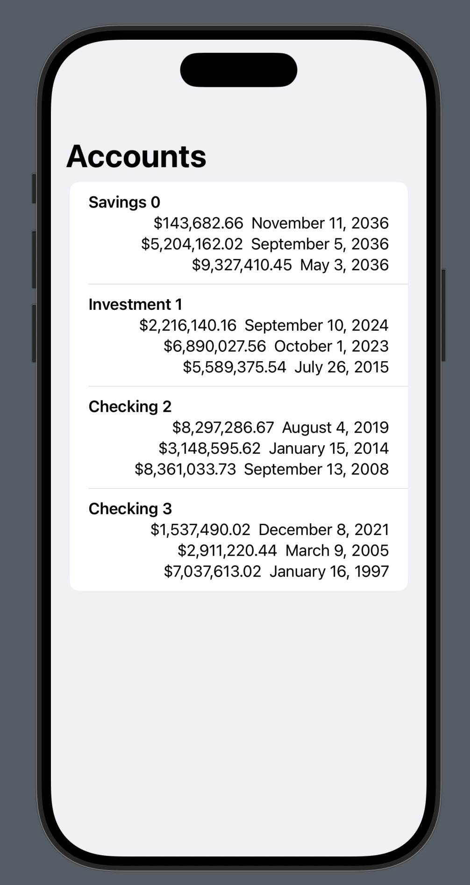
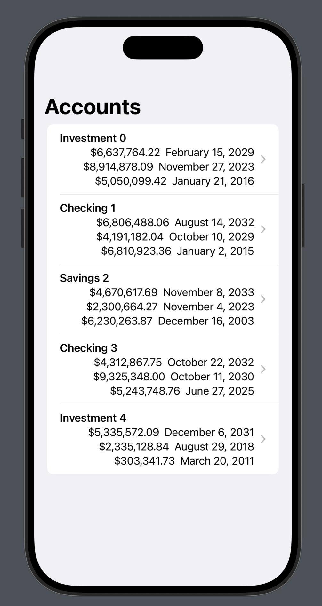
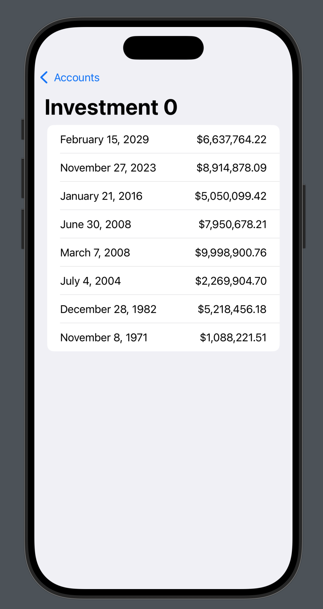
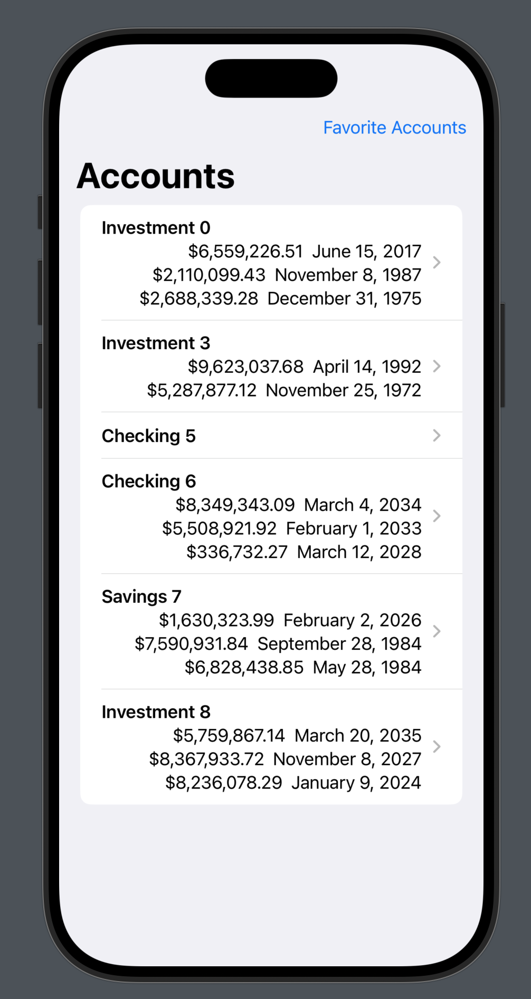
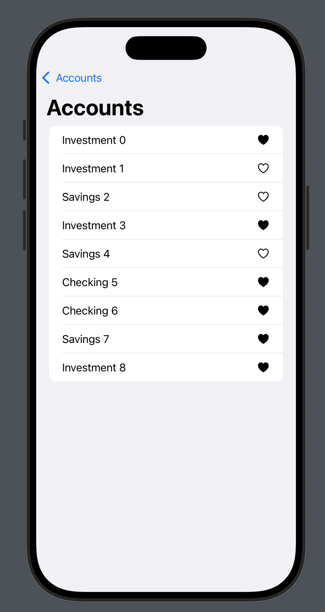

# SampleAccountBank – iOS  

SampleAccountBank is a challenge project to showcase some basic views in SwiftUI and how dependencies and views change.

- [x] **(30 min)** Create a View to show users their bank accounts, and the 3 most recent transactions in each account

- [x] **(30 min)** When a user clicks on an account, show all the transactions in the account in a new view in order of most recent

- [x] **(30 min)** Create a View to allow users to favorite accounts, also only show favorited accounts on the main view

- [ ] **(15 min discussion)** What would you work on next to improve the App? How would you go about adding that new feature?
    -   Architecture (what architecture would you recommend?)
    -   Unit Tests (try making some)
    -   improve User Interface (what would you work on first?)
